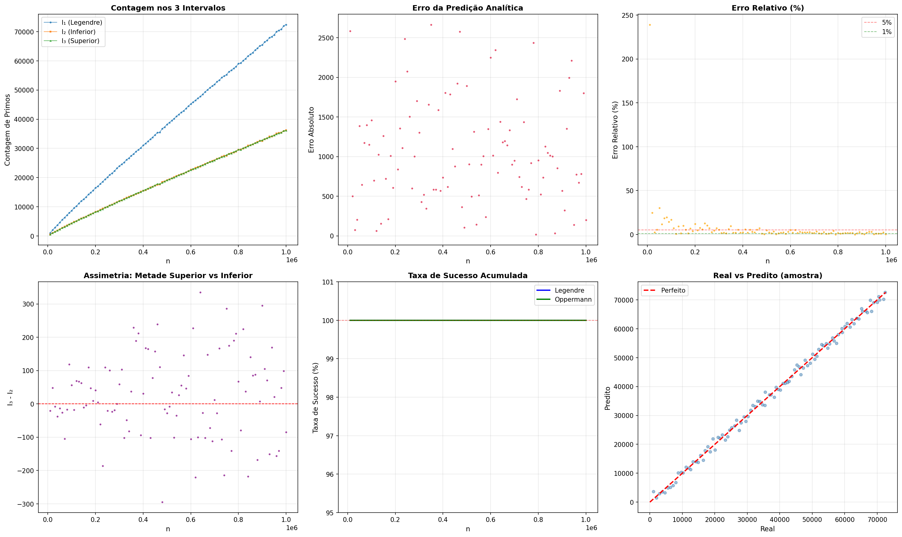
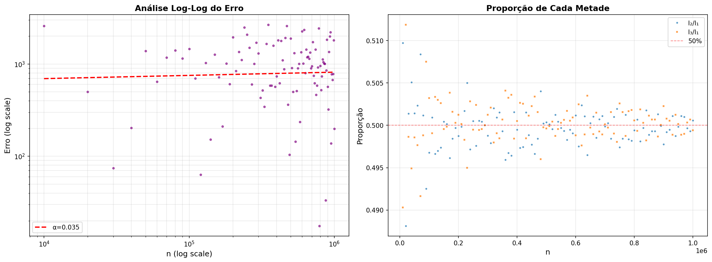

# 🧪 Math Lab: Validação Numérica de Conjecturas de Primos

Este projeto é um laboratório computacional desenvolvido para testar a robustez de conjecturas clássicas da Teoria dos Números utilizando Python de alta performance.

O objetivo principal foi validar a **Conjectura de Legendre** e a **Conjectura de Oppermann** até $n = 1.000.000$, cruzando contagens reais de números primos com predições analíticas baseadas nos Zeros Não-Triviais da Função Zeta de Riemann.

## 🎯 O Que Foi Testado?

1.  **Conjectura de Legendre:** Existe sempre um número primo entre $n^2$ e $(n+1)^2$?
2.  **Conjectura de Oppermann:** A distribuição dos primos é simétrica? Ou seja, existem primos tanto na metade inferior $[n^2, n(n+1)]$ quanto na superior $[n(n+1), (n+1)^2]$?

## 📊 Resultados Visuais

A validação foi bem sucedida para 100% dos casos no intervalo testado.

### Visão Geral da Distribuição e Erro

*O gráfico "Real vs Predito" (canto inferior direito) demonstra a precisão da Fórmula Explícita de Riemann ao prever a contagem de primos.*

### Análise de Simetria e Estabilidade

*A análise Log-Log sugere que o erro cresce de forma controlada ($\alpha < 0.5$), consistente com a Hipótese de Riemann.*

## 🛠️ Stack Tecnológico

Este projeto foi desenvolvido com foco em "Vibe Coding" (eficiência e prototipagem rápida) mas com rigor matemático:

* **Python 3.10+**
* **Numba (JIT):** Para compilação *Just-In-Time* das funções de soma sobre os zeros da Zeta (velocidade próxima de C).
* **SymPy:** Para a função `primepi` (contagem exata de primos - "Ground Truth").
* **Mpmath:** Para cálculo de alta precisão dos zeros da função Zeta.
* **Matplotlib:** Visualização de dados.

## 🚀 Como Executar

Este projeto foi otimizado para rodar no Google Colab.

1.  Abra o arquivo `.ipynb` neste repositório.
2.  Clique no botão "Open in Colab".
3.  Execute as células sequencialmente.
    * *Nota: O script calcula automaticamente os zeros da Zeta na primeira execução e cria um cache local.*

## 👨‍💻 Autor

**Álvaro Alencar**
*Fundador da Vortex Development | Curador de IA*
